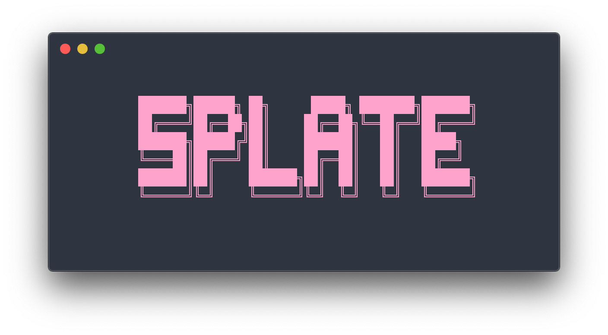

# SPLATE

**SPLATE** is an SCSS boilerplate for use in styling frontend web development projects. It’s based on the [7-1](https://sass-guidelin.es/) SCSS format, but adapted to my own needs and preferences. SPLATE keeps your styles neat and tidy, and provides leeway for adding your own custom rules.

## What is ‘SCSS’?

[SCSS](https://sass-lang.com/documentation/syntax) (Sassy CSS) is a syntax style for SASS (Syntactically Awesome Style Sheets), which is itself an extension language for CSS. What does any of that mean? Webpages and web-based projects are styled with CSS, and while much can be achieved with default CSS, SCSS allows for more dynamic stylesheets that are easier to maintain, and add deeper programmatic functionality with utilities like variables, modules, nesting, and functions.

One of SCSS’s best features is the ability to separate styles into [_partials_](https://sass-lang.com/guide#topic-4#), allowing you to organize your styles into a more modular filetree that’s easier to work with. The partials contain small, modular bits of SCSS, which are imported into a main SCSS file before compiling. SPLATE is a pre-made directory structure for just such a use case.

[Learn SASS](https://sass-lang.com/guide)

## Usage

SCSS needs to be compiled into CSS before it can be recognized by a browser. If you use VS Code, I recommend using the [Live SASS Compiler extension](https://marketplace.visualstudio.com/items?itemName=ritwickdey.live-sass) to compile your SCSS in real-time as you write it. You can also follow this [SASS preprocessing guide](https://www.freecodecamp.org/news/give-more-oompf-to-your-web-garnishes-with-preprocessors-in-sass-bd379226a114/) for compiling from the command line with Node.

## Contributing

I’m not currently looking for contributions to SPLATE. However, if you feel something could be improved, feel free to submit an issue for discussion. Any and all ideas will be considered!

## License

This project is licensed under the [MIT License](./LICENSE.md). SPLATE is just a bunch of files—fork, tweak, and destroy them as you see fit.

---

### To Do

- Add basic baked-in variables, mixins, etc., to plug root values into
- Add documentation for compiling
